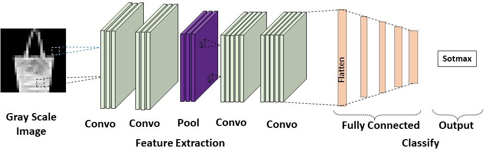

Simple CNN For Image Classification
========

 

Created by
* [Md. Nadim Mahamood]
  * Begum Rokeya University, Rangpur
 


This repository contains implementation for CNN.

## Description


The architecture is simple CNN, consisting of three phases. The first two are used for feature extraction and the last one is for feature as well as classification. In the first phase, the are two consecutive Convolution operations using kernels with size 3X3 for increasing the number of channels followed by a Max pool for dimension reduction. In the second phase, the are two consecutive Convolution operations using kernels with dimension 3X3 for an increased number of channels. In the last phase, there are 5 consecutive fully connected layers with node sizes 1024, 128, 64, 32, and 16, respectively and finally the addition of 10 nodes with softmax for classification.  In addition, their Cross-entropy and Adam optimizers are used for calculating loss and updating weight and biases. Also, learning rate Schulder and different metrics were used to measure the performance of the model.

## Schematic diagrams

The overall architecture of propsed CNN is


### Image size 
 
```
├─|28x28x1| -> |26x26x10| -> |24x24x10| -> |12x12x10| ->|10x10x16| -> |8x8x16| ->  |128| -> |64| -> |32|-> |16|-> |10|
```
 


### Data preparation
The directory structure should be as follows.

```
├──train.csv/
│  ├── row1
│  │── row2
│  │── row3
│  │── ......
├──test.csv/
│  ├── row1
│  │── row2
│  │── row3
│  ├── ......
```

### Data preprocesing
The decription of data preprocessing are given below:


#### Train
Data read from CSV file and then, reshaped into size of 28X28 and extract label also.
Then, different transformations are used e.g., HorizontalFlip, VeticalFlip, RandomErasing and normalize etc
to enhance the training.
#### Test
Data read from CSV file and then, reshaped into size of 28X28 and extract label also. The only normalize are u
sed during testing.
 

### Traning


Command line for train.
 ```
python main.py /path/to/train dataset 
```

### Validation
To evaluate our Sequencer models, run:
```
python evaluate_model.py /path/to/evalute dataset
```

 